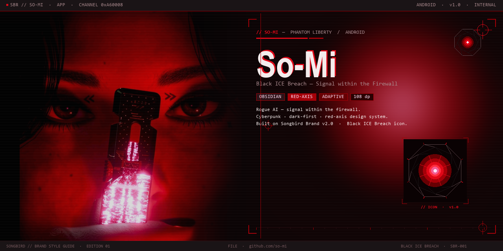

<div align="center">



# So-Mi — Offline-First Android-Assistentin

**Persönliche KI. Vollständig lokal. Kein Account. Keine Cloud.**

[](https://github.com/Labushuya/so-mi/releases/latest)
[](https://github.com/Labushuya/so-mi/releases/latest)
[](LICENSE)
[](#roadmap)
[](https://huggingface.co/Qwen/Qwen2.5-7B)
[](https://github.com/Labushuya/so-mi/actions)
[](https://kotlinlang.org)
[](https://developer.android.com/jetpack/compose)
[](https://developer.android.com/ndk)
[](README.md)

</div>

---

> Persönlichkeit angelehnt an **Songbird / So-Mi** aus *Cyberpunk 2077: Phantom Liberty* — als tägliche Begleiterin, nicht als 1:1-Kopie. Deutsche Primärsprache mit Englisch/Koreanisch-Codeswitching.

---

## Was ist So-Mi?

So-Mi ist eine offline-first Android-App die ein lokales Sprachmodell direkt auf deinem Gerät ausführt. Gespräche, Erinnerungen, Persönlichkeit — alles bleibt auf dem Gerät. Keine Nutzerdaten verlassen das Handy, außer du nutzt explizit Online-Tools wie Web-Suche oder Wetter.

**Zielgerät:** HONOR Magic V2 (16 GB RAM)  
**Verteilung:** Sideload via [GitHub Releases](https://github.com/Labushuya/so-mi/releases/latest)  
**Keine Play-Store-Veröffentlichung geplant.**

---

## Features

<table>
<tr>
<td width="50%">

### 🧠 Lokales LLM
- llama.cpp via ARM InferenceEngine (NDK r27, arm64-v8a)
- Standardmodell: **Qwen2.5 7B Q4\_K\_M** (~4.5 GB)
- Optional: Mistral-Nemo 12B, weitere GGUF-Modelle
- Sliding-Window Gesprächskontext (14 Nachrichten)
- Glitch-Shader-Effekte, immersiver Vollbild-Modus

### 💾 Gedächtnis & RAG
- `/merke Ich bin SRE #Arbeit cloud,sre` → gespeichert in Kategorie "Arbeit"
- Inline-Kategorie mit `#Tag` + Keywords `kw1,kw2` — neue Kategorien auto-erstellt
- LLM-gestützte Faktklassifizierung (Personen / Vorlieben / Termine / Technik / Notizen)
- **HNSW-Vektorsuche** (ObjectBox + 384-dim-Embedder)
- 50+ natürlichsprachliche Trigger: "Das ist wichtig:", "FYI:", "Ach ja:" etc.

</td>
<td width="50%">

### 🛠 Tool-System
- **11 aktive Tools**, jedes einzeln de-/aktivierbar
- Tool-Routing via Regex (50+ Patterns pro Tool)
- Klarer Hinweis wenn ein Tool deaktiviert ist

### 💬 Chat & UI
- Multi-Chat: mehrere Gespräche, umbenennen / archivieren
- Slash-Commands mit Autocomplete: `/search`, `/rename`, `/clear`
- Status-Bänder (Error / Warning / Success / Info)
- Backup & Import als ZIP (Erinnerungen + Chat-Verlauf)

### 🔒 Datenschutz
- 100 % lokale Verarbeitung — standardmäßig kein Netzwerk
- Keine Telemetrie, kein Analytics, kein Crashlytics
- Claude API optional, hinter BiometricPrompt gesichert

</td>
</tr>
</table>

---

## Tool-Übersicht

| Tool | Beschreibung | Trigger-Beispiele |
|------|-------------|-------------------|
| 🌤 `get_weather` | Wetter via Open-Meteo (kein Key) | *"Wetter morgen in Berlin"*, *"Wetter am Wochenende"* |
| 🔍 `search_web` | Web-Suche via SearXNG (kein Key) | *"@web EU AI Act aktuell"* |
| 🧠 `search_memory` | Eigene Erinnerungen semantisch suchen | *"@erinnerung Familie"*, *"Was weißt du über mich?"* |
| ⏰ `set_alarm` | Alarm / Benachrichtigung setzen | *"Erinner mich in 20 Minuten"* |
| 💱 `get_exchange_rate` | Echtzeit-Wechselkurse | *"Wie viel sind 100 EUR in USD?"* |
| 📰 `news_briefing` | RSS-Feeds (Tagesschau, Spiegel, Heise) | *"@news"*, *"Aktuelle Nachrichten"* |
| 📅 `read_calendar` | Google Kalender & Systemkalender | *"Zeig meine Termine diese Woche"* |
| ➕ `create_event` | Kalendertermin anlegen | *"Meeting morgen 14 Uhr eintragen"* |

---

## Technologie-Stack

<div align="center">

| Schicht | Technologie |
|---------|-------------|
| **LLM** | llama.cpp · ARM InferenceEngine · Qwen2.5 7B Q4\_K\_M |
| **Embedding** | paraphrase-multilingual-MiniLM-L12-v2 · ONNX Runtime 1.18 |
| **Vektorspeicher** | ObjectBox 4.0.3 · HNSW-Index (384 dim, Cosine) |
| **Persistenz** | Room 2.7 (SQLite WAL) · DataStore · EncryptedSharedPreferences |
| **UI** | Jetpack Compose · Material3 · GLSL Glitch-Shader |
| **DI** | Hilt 2.52 · KSP |
| **Build** | AGP 8.5.2 · Kotlin 2.0.21 · NDK r27 · Gradle 8.10 |
| **CI/CD** | GitHub Actions · release-please · apksigner |

</div>

---

## Command-Referenz

So-Mi nutzt eine einheitliche Command-Sprache: **`/`** für App-Funktionen, **`@`** für Tools. Beide mit Smart-Autocomplete und Syntax-Hints im Textfeld.

### `/` — App-Funktionen (kein LLM-Call)

```
/merke [fakt] #Kategorie kw1,kw2   Fakt speichern · Kategorie + Keywords optional
/merke Ich bin SRE #Arbeit cloud   → In "Arbeit" gespeichert, Keyword "cloud" eingetragen
/merke Ich spiele Gitarre #Hobby   → Neue Kategorie "Hobby" wird automatisch erstellt

/suche [Begriff]                   Nachrichten im Chat durchsuchen
/umbenennen                        Gespräch umbenennen
/archivieren                       Gespräch ausblenden
/leeren                            Alle Nachrichten löschen
```

### `@` — Tool-Aufrufe (LLM verarbeitet das Ergebnis)

```
@wetter [Ort]                      @wetter Berlin morgen
@web [Anfrage]                     @web KI-Regulierung 2026
@alarm [Zeit] [Text]               @alarm 15min Fenster schließen
@kurs [Anfrage]                    @kurs 250 EUR in USD
@news                              Aktuelle Nachrichten (Tagesschau, Spiegel, Heise)
@kalender [Zeitraum]               @kalender diese Woche
@termin [Titel] [Zeit]             @termin Meeting morgen 14 Uhr
@erinnerung [Begriff]              Erinnerungen semantisch suchen
@notizen [Begriff]                 Notizen durchsuchen
@zusammenfassung [Text]            Text lokal zusammenfassen
```

### Natürliche Sprache (automatisches Tool-Matching)

```
"Soll ich einen Schirm mitnehmen?"     → Wetter
"Weck mich in 10 Minuten"              → Alarm
"Was kostet ein Dollar in Euro?"       → Wechselkurs
"Das ist wichtig: [Fakt]"              → Erinnerung speichern
"FYI: [Fakt]" / "Ach ja: [Fakt]"      → Erinnerung speichern
"TL;DR: [langer Text]"                 → Zusammenfassung
"Bin ich morgen beschäftigt?"          → Kalender
```

---

## Architektur

```
android/
├── app/               Compose UI · Navigation · ViewModels · Hilt-Wiring
├── core-llm/          LlamaContext Interface
├── core-llm-llama/    ARM InferenceEngine JNI-Wrapper (NDK, llama.cpp)
├── core-rag/          ObjectBox HNSW · ONNX Embedder · RagOrchestrator
├── core-tools/        Tool-Router (Regex) · 11 Tools
├── core-data/         Room · DataStore · BackupManager · StorageRoots
├── core-ui/           ChatViewModel · Slash-Commands · RAG-Integration
└── core-common/       Shared Interfaces (TextEmbedder · MemorySearchPort · LlmCaller)

soul/soul.md           Persönlichkeit — fester System-Prefix, nie via RAG
keystore/ci.keystore   CI-Signatur (öffentlich committed — Sideload, Update-Kontinuität)
```

> **Modul-Regel:** `core-*` darf nur `core-common` importieren. Cross-Modul-Wiring läuft über Interfaces oder `app/`.

---

## Installation

```bash
# 1. APK herunterladen
# → github.com/Labushuya/so-mi/releases/latest → app-release.apk

# 2. Auf Android: Unbekannte Quellen erlauben → APK tippen

# 3. Beim ersten Start: Benachrichtigungs- & Kalender-Berechtigung erlauben

# 4. Modell laden: Settings → Modelle → Qwen2.5 7B (WLAN empfohlen, ~4.5 GB)
```

**Updates** installieren sich über die vorherige Version — gleicher Signing-Key, gleiche `applicationId`.

---

## Lokal bauen

```bash
git clone https://github.com/Labushuya/so-mi
cd so-mi/android

# SDK-Pfad setzen
echo "sdk.dir=/path/to/Android/Sdk" > local.properties

# Debug-Build
./gradlew :app:assembleDebug

# Release-Build (versionCode höher als installierte Version)
./gradlew :app:assembleRelease -PversionCode=99999 -PversionName=local
```

Der Release-Build verwendet `keystore/ci.keystore` mit dem öffentlichen Passwort `ci-password-public` — bewusst im Klartext, da Sideload-only und Update-Kontinuität wichtiger ist als Signing-Geheimhaltung (siehe [SPEC.md §5](SPEC.md)).

---

## Roadmap

| Phase | Stand | Details |
|-------|-------|---------|
| Phase 0–2: Bootstrap, Pipeline, LLM + Chat | ✅ Abgeschlossen | |
| Phase 3: RAG + Persona-Memory | ✅ Abgeschlossen | HNSW, Backfill, Multi-Chat, Backup |
| Phase 4: Tool-System | 🟡 11 von 12 Tools stabil | Kalender, Wetter, Web, Alarm, Nachrichten, Wechselkurs, Notizen, Zusammenfassung |
| Phase 5: Voice + In-App-Updater | ❌ Geplant | |

→ Detaillierter Fortschritt: **[ROADMAP.md](ROADMAP.md)**

---

## Lizenz

Copyright © 2024–2026 Christopher Bott (Labushuya | MindsourcesDOTnet). Alle Rechte vorbehalten.  
Siehe [LICENSE](LICENSE) für Details.

---

<div align="center">
<sub>So-Mi ist ein persönliches Sideload-Projekt · Kein Play-Store · Kein Support-Versprechen</sub>
</div>
